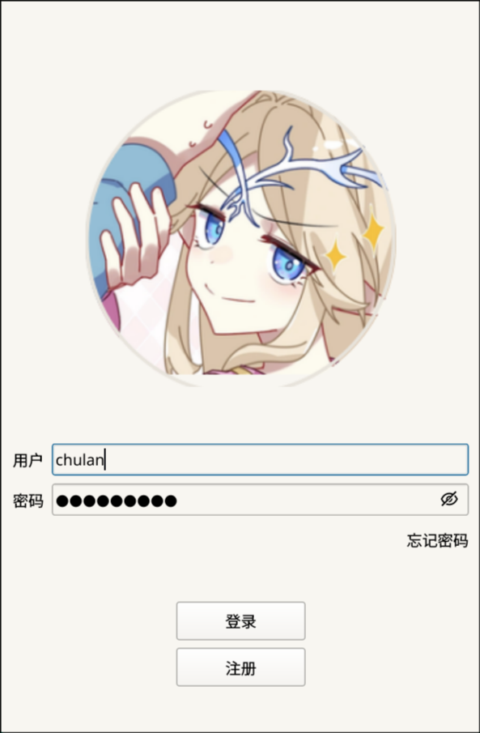
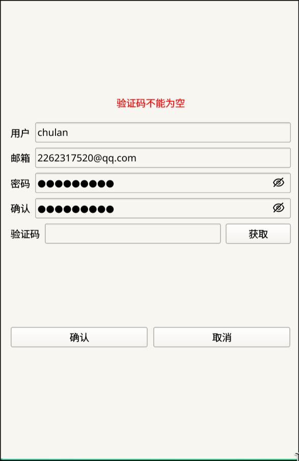
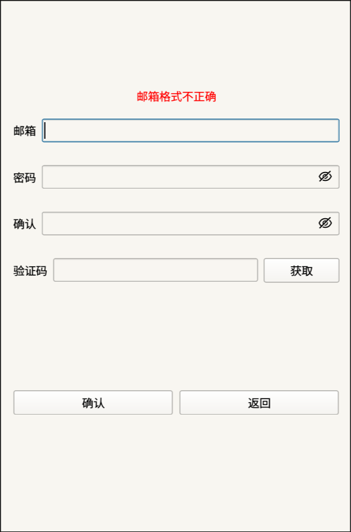

# ChatRoom Client

这个部分是基于 Qt 框架的聊天室客户端，采用 C++23 标准开发。

> 下面的所有路径相关的都假设以 **项目根目录** 作为开始。

## 快速开始

### 环境要求

详细可以参考 [ci](../.github/workflows/client-release.yml) 里的配置，那个在 `ubuntu:latest` 上可以通过的，是从头开始的环境，主要有如下几个:

- Qt 6.x
- CMake 3.16+
- OpenSSL 3+，用于 HTTPS 通信
- 支持 C++23 的编译器，如 GCC 13+、Clang 16+

### 配置修改

我们是通过 [config.ini](./config.ini) 来配置请求的地方的，开发保持默认即可，如果需要修改，可以参考下面的说明:

```ini
[ChatRoomBackend]
host = 127.0.0.1    # 网关地址
port = 10001        # 网关端口
```

### 本地开发

**方式一：Qt Creator**

直接用 Qt Creator 打开 `chatroom/CMakeLists.txt` 即可。

**方式二：命令行**

```bash
cd chatroom
cmake -S . -B build -DCMAKE_BUILD_TYPE=Release
cmake --build build
./build/chatroom
```

### 打包部署

```bash
./scripts/deploy_client.sh
```

脚本会自动打包成 AppImage，输出到 `deploy/client/ChatRoom-x86_64.AppImage`。

## 项目介绍

### 目录说明

```
chatroom/
├── main.cc                 # 程序入口
├── mainwindow.*            # 主窗口，管理页面切换
├── logindialog.*           # 登录页面
├── registerdialog.*        # 注册页面
├── resetpassworddialog.*   # 重置密码页面
├── chatdialog.*            # 聊天页面（开发中）
├── httpmanager.*           # HTTP 请求管理器
├── tcpmanager.*            # TCP 长连接管理器
├── userinfo.*              # 用户信息存储
├── serverinfo.*            # 服务器信息存储
├── timerbutton.*           # 倒计时按钮组件
├── global.*                # 全局定义
├── Defer.hpp               # RAII 工具类
├── config.ini              # 配置文件
├── docs/
│   └── develop.md          # 开发日志
└── resources/              # 资源文件（图片、样式等）
```

### 模块说明

| 模块 | 说明 |
|------|------|
| **main** | 程序入口，负责加载资源文件、样式表及初始化应用程序 |
| **MainWindow** | 主窗口，使用 QStackedWidget 管理多页面切换 |
| **LoginDialog** | 登录页面，处理用户登录逻辑 |
| **RegisterDialog** | 注册页面，包含邮箱验证码校验 |
| **ResetPasswordDialog** | 重置密码页面，流程与注册类似 |
| **ChatDialog** | 聊天页面（开发中） |
| **HttpManager** | 封装 Qt Network，处理与网关的 HTTP 通信，目前支持 POST 请求 |
| **TcpManager** | 管理与聊天服务器的 TCP 长连接 |
| **UserInfo** | 存储当前登录用户的信息（uuid、昵称、头像等） |
| **ServerInfo** | 存储聊天服务器连接信息（host、port、分布式校验 token） |
| **TimerButton** | 可复用的倒计时按钮，用于验证码发送 |
| **global** | 全局定义，包含请求 ID、模块枚举、错误码等 |
| **Defer** | RAII 工具类，模仿 Go 的 defer 关键字 |

### 使用说明

除了上述说到的组件，这里提供了一些便捷的快捷键:

- `Ctrl + Q`：退出程序(主要是方便 wayland 环境下没有 titlebar 时关闭程序)

### 效果展示

目前界面较为简陋，后续会逐步完善 UI 设计，下面是现在已完成的界面截图:

| 登录 | 注册 | 重置密码 |
|:----:|:----:|:--------:|
|  |  |  |

## 开发文档

详细的开发进度和变更记录请参考 [docs/develop.md](docs/develop.md)。

## TODO

- [ ] 完善聊天界面 UI
- [ ] 实现 https 支持
